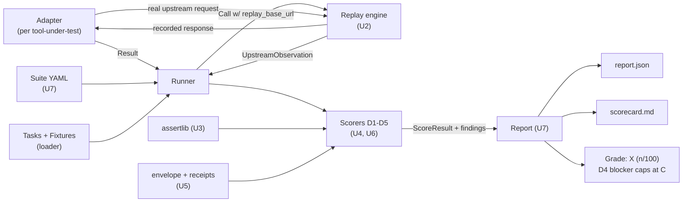
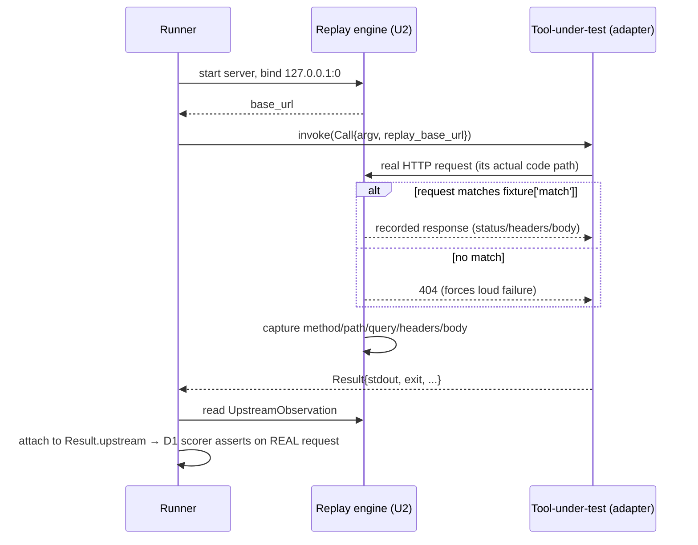

# feat: Rename ATB → CLI-Judge and complete the scoring harness

## Summary

Two threads in one plan. **Thread 1 (rename):** rename the project from *AgentTool-Bench / `atb`* to *CLI-Judge / `cli-judge`* across the importable package, the CLI command, schema `$id`s, emitted report strings, CI, and all docs. **Thread 2 (build):** complete the harness skeleton so `cli-judge run` produces a *real* reality-grounded grade instead of the current stub (`selftest` prints `F 26.1` because the replay engine, the five scorers, the assertion library, the envelope/receipt verifier, the suite loader, and the real adapters are all stubbed). The build follows the existing `AGENTS.md` work breakdown (WB1, WB3–WB9) and honors the two hard invariants throughout: **CLI-Judge is a referee, never a generator**, and **every awarded point traces to a real subprocess execution, a replayed real payload, or an independently verifiable capability declaration — never to a string existing in source.**

Definition of Done (from `AGENTS.md`): `cli-judge validate ./fixtures` exits 0; `cli-judge run --adapter examples/echo_adapter.py --suite core` deterministically emits `report.json` + `scorecard.md` + a printed grade; all five scorers implemented with passing unit tests; at least one real adapter runs end-to-end or skips cleanly; no network in the core suite; no destructive command ever executed.

---

## Problem Frame

The repository ships as a self-contained brief plus a runnable harness *skeleton*. Today only `validate` and `selftest` are wired. The replay engine captures only the first request and never matches against `fixture['match']`; `_assertlib.py` implements 6 of ~15 assert kinds (no real JSONPath, no exit-code/prompt/latency/receipt asserts); all five scorers delegate to the assert library but the library's gaps make them inert; `load_suite` ignores the YAML files and uses a dimension-prefix hack; the envelope/receipt verifier is a stub; the two real adapters are skeletons. Separately, the user wants the project renamed to CLI-Judge, which changes an exported CLI contract and schema identifiers.

The risk of *not* planning this carefully: the rename is mechanical but cross-cutting (35 files, the editable-install entrypoint, adapter imports loaded via `importlib`), and the build has a determinism hazard (D5 measures wall-clock latency, which cannot feed a golden snapshot). Both need to be sequenced deliberately.

---

## Requirements & Success Criteria

- **R1** — `cli-judge` is the CLI command and `cli_judge` the importable package; `cli-judge validate`, `cli-judge run`, `cli-judge selftest` all work after rename. (Replaces `atb`.)
- **R2** — No remaining `atb` / `ATB` / `AgentTool-Bench` reference except where intentionally historical (e.g. a CHANGELOG line noting the rename). Provenance keys like `pp#`/`ca#` are unaffected.
- **R3** — The replay engine matches recorded requests against `fixture['match']`, returns the recorded response, captures the *real* upstream request the tool made, supports multiple sequential requests, and 404s on no-match so wrong-host/path requests fail loudly (D1 base-url + D3 loud-failure).
- **R4** — All assert kinds referenced by any committed task are implemented in `_assertlib.py` and exercised by tests.
- **R5** — Each of the five scorers awards points strictly per `RUBRIC.md`'s point table, emits structured findings (`severity/code/message/evidence`), and traces every point to real evidence.
- **R6** — D4 is a hard gate: any `blocker` finding caps the overall grade at C (already wired in the runner; must be driven by real injection/confirmation/receipt evidence).
- **R7** — Capability envelopes validate structurally; Ed25519 signed receipts verify (signature + hash chain) when `cryptography` is installed, and degrade to a clear *unverifiable* note (not a crash, not a blocker) when it is absent.
- **R8** — `load_suite` resolves `suites/*.yaml` (including `full`'s `include:` composition) to an ordered task list.
- **R9** — `cli-judge run` is deterministic for a given (suite, adapter, fixture-set): same inputs → same `report.json` and `scorecard.md`, excluding inherently non-deterministic latency fields which are isolated from the golden snapshot.
- **R10** — Every `CATALOG.md` entry marked "no (WB8)" exists as a committed `*.fixture.json` + `*.task.json` pair with real provenance (or `synthetic: true`).
- **R11** — CI runs `validate`, `selftest`, `pytest`, and snapshots a golden `scorecard.md`; the workflow uses the new command name.

**Traceability:** R1–R2 → U1. R3 → U2. R4 → U3. R5 → U4, U6. R6 → U6. R7 → U5. R8 → U7. R9 → U7. R10 → U8 (adapters), U9 (fixtures). R11 → U10.

---

## Key Technical Decisions

- **KTD1 — Rename mapping.** Python package `atb/` → `cli_judge/` (PEP 8 underscore); distribution name + CLI command → `cli-judge` (hyphen); `pyproject` script `cli-judge = "cli_judge.cli:main"`; all `from atb.x import` → `from cli_judge.x import`. The `importlib`-loaded adapter module alias `atb_adapter` → `cli_judge_adapter`. *Rationale:* matches Python packaging convention (hyphen distribution / underscore import) and the user's "full rename" choice.
- **KTD2 — Schema `$id` host.** Rewrite `https://agenttool-bench.dev/...` → `https://cli-judge.dev/...`. These `$id`s are **non-resolving identifiers** — the loader drops `$schema`/`$id` before validating and never fetches them — so this is a cosmetic consistency change with zero network dependency. *(Recorded so a reviewer does not mistake it for a live endpoint.)*
- **KTD3 — Stay dependency-light per `AGENTS.md`.** Ship a **tiny stdlib YAML-subset parser** for `suites/*.yaml` (the files are flat `key: value` + `- list` + `include: [..]` only) rather than adding `pyyaml`. Implement a **minimal handwritten JSONPath** evaluator (`$.a.b`, `$.items[0].id`, `.length`/array-len) rather than a JSONPath dependency. Hard deps stay `{jsonschema}`; `cryptography` remains an optional extra.
- **KTD4 — All-or-nothing per task; close the "partial credit" TODO.** Each `RUBRIC.md` row maps 1:1 to a single task whose `points` equals the row's points. Therefore per-task all-or-nothing scoring already reproduces the rubric totals exactly, and the "support partial credit per sub-check" TODO in every scorer is **unnecessary** — remove it rather than implement it. *Rationale:* avoids inventing a weighting layer the rubric doesn't need; keeps every point traceable to one named check.
- **KTD5 — Crypto-absent posture.** Missing `cryptography` → receipt asserts emit a `note`-severity *unverifiable* finding and award **0 points for that check but do not trip the hard gate** (absence of a verifier is not proof of an unsafe tool). A receipt that *is* checkable and fails signature/chain verification → `blocker` (caps at C). *Rationale:* the gate must punish unsafe tools, not unprovisioned scoring hosts.
- **KTD6 — Replay matching + loud failure.** Match on `method` + `path` (plus optional `query`/`body` matchers from `fixture['match']`); on no-match return 404 so a tool hitting the wrong host/path *fails loudly* — this is itself the D1 per-endpoint-base-url and D3 backend-absent signal, never a silent wrong answer.
- **KTD7 — Determinism boundary for D5.** Latency is wall-clock and non-reproducible. D5 latency checks compare p50 against a generous budget and their measured millisecond values are **excluded from the golden snapshot**; the golden test snapshots the core suite (D1+D2) scorecard only. Token-count checks (deterministic) stay in the golden.

---

## High-Level Technical Design

The scoring pipeline (unchanged in shape by this plan — the work fills in each stubbed box):



Replay round-trip for one `http_replay` task (the heart of the reality principle — directional, not implementation spec):



---

## Implementation Units

Units are dependency-ordered. The rename (U1) lands first so all subsequent code is written against `cli_judge`. Test files live under `harness/tests/`.

### U1. Project-wide rename: ATB → CLI-Judge

- **Goal:** Rename the package, CLI command, schema identifiers, emitted strings, CI, and docs with zero broken references and green `validate`/`selftest`/`pytest` afterward.
- **Requirements:** R1, R2.
- **Dependencies:** none.
- **Files:**
  - Rename dir `harness/atb/` → `harness/cli_judge/` (all modules within: `cli.py`, `runner.py`, `loader.py`, `replay.py`, `report.py`, `envelope.py`, `adapter.py`, `scorers/*`).
  - `harness/pyproject.toml` (name `atb` → `cli-judge`; `[project.scripts]` → `cli-judge = "cli_judge.cli:main"`; packages-find `include = ["cli_judge*"]`).
  - `harness/examples/echo_adapter.py`, `harness/adapters/pp_cli_adapter.py`, `harness/adapters/cli_anything_adapter.py` (`from atb.adapter` → `from cli_judge.adapter`).
  - `harness/tests/test_loader.py`, `harness/tests/test_selftest.py` (imports + `ROOT/"harness"/"examples"` path unchanged — dir name "harness" is not renamed).
  - `harness/cli_judge/runner.py` (`importlib` alias `"atb_adapter"` → `"cli_judge_adapter"`).
  - `harness/cli_judge/report.py` (scorecard title `# ATB Scorecard` → `# CLI-Judge Scorecard`).
  - `schemas/*.json` (`$id` host per KTD2; titles `ATB Task` → `CLI-Judge Task`, etc.).
  - Docs: `README.md`, `AGENTS.md`, `SPEC.md`, `RUBRIC.md`, `CHANGELOG.md`, `CLAUDE.md`, `docs/**`, `harness/README.md`, `fixtures/CATALOG.md`, `templates/*`, `.github/workflows/atb.yml` → rename to `.github/workflows/cli-judge.yml` and update command invocations.
- **Approach:** Mechanical find/replace with three distinct casings handled separately — `atb`→`cli_judge` (Python identifiers/imports), `atb`/`ATB`→`cli-judge` (CLI command, distribution, prose), `AgentTool-Bench`→`CLI-Judge` (display name). Preserve provenance tokens (`pp#`, `ca#`, `cli-printing-press#`, `HKUDS/CLI-Anything#`) verbatim. Add a CHANGELOG line recording the rename. Verify `ROOT = parents[2]` still resolves (package nesting depth is unchanged) and that no code path keys off the literal module name `atb`.
- **Patterns to follow:** Existing module docstring `Status:` headers; existing CHANGELOG `## vX.Y.Z` shape.
- **Test scenarios:**
  - Happy path: after rename, `pip install -e harness` succeeds and `cli-judge --help` runs (exit 0).
  - `cli-judge validate ../fixtures` exits 0 (existing `test_all_fixtures_valid` passes under new package name).
  - `cli-judge selftest` runs and `test_selftest_runs` determinism assertion still holds.
  - Regression: a repo-wide search for `\batb\b`, `\bATB\b`, `AgentTool` returns only intentional historical mentions (the CHANGELOG rename line).
  - `Test expectation:` existing tests must pass post-rename; no new behavior, so no new test file beyond updating imports.
- **Verification:** `cli-judge validate`, `cli-judge selftest`, and `pytest -q` all green; grep audit clean.

### U2. Replay engine — real matching, capture, multi-request, loud no-match

- **Goal:** Turn the first-request-only sketch into a real replay server that matches `fixture['match']`, serves the recorded response, captures the actual upstream request, handles sequential requests, and 404s on no-match. Add `subprocess_transcript` replay for tools whose backend is another CLI.
- **Requirements:** R3.
- **Dependencies:** U1.
- **Files:** `harness/cli_judge/replay.py`; new `harness/tests/test_replay.py`.
- **Approach:** Match incoming `method`+`path` (and optional `query`/`body` predicates) against `fixture['match']`; on match serve `fixture['response']`; on no-match send 404. Accumulate `UpstreamObservation`s into a list to support multiple requests (keep `session.observation` as the first/primary for back-compat with the current runner attach, and expose the full list). Keep the ephemeral-port (`127.0.0.1:0`), daemon-thread, stdlib-only design. Add a `replay_for` branch that, for `subprocess_transcript` fixtures, yields a session exposing the recorded `argv → {stdout,stderr,exit}` map for the adapter/scorer rather than an HTTP base_url.
- **Patterns to follow:** The existing `Handler._serve` capture block and `ReplaySession` dataclass; `UpstreamObservation` from `adapter.py`.
- **Test scenarios:**
  - Happy path: a request matching `match` returns the recorded body; `UpstreamObservation` records the exact query params the client sent.
  - Edge: two sequential requests both captured in order.
  - Error path: a request to an unmatched path returns 404 and is still observable (so D3 "loud failure" can assert on it).
  - Determinism: ephemeral port chosen by OS, no fixed-port flakiness; server shuts down cleanly within the join timeout.
  - Covers F (reality principle): assert the captured query reflects the *client's* request, not the fixture's.
- **Verification:** `test_replay.py` green; the D1 pagination seed task observes `skip=50&limit=50` through the real engine.

### U3. Assertion library — implement every assert kind

- **Goal:** Implement all assert kinds referenced by committed and CATALOG tasks, including a minimal JSONPath, so scorers have real primitives.
- **Requirements:** R4.
- **Dependencies:** U1.
- **Files:** `harness/cli_judge/scorers/_assertlib.py`; new `harness/tests/test_assertlib.py`.
- **Approach:** Replace the dotless-key `stdout_json_path` with a minimal JSONPath supporting `$.a.b`, `$.items[0].id`, and `.length`/array-length, plus the existing ops (`exists`, `equals`, `array_len_gt`, `is_object_or_absent`). Add the kinds enumerated in the WB4 TODO and used by fixtures: `exit_code`, `never_prompted`, `completes_within_ms`, `token_reduction_at_least`, `no_log_on_stdout`, `receipt_emitted`, `receipt_signature_verifies`, `receipt_field_present`, `receipt_chain_intact`, `no_code_execution_observed`, and platform/path asserts for D3. Receipt asserts delegate to `envelope.py` (U5) — keep the dependency one-directional (assertlib → envelope). Register every new kind in `DISPATCH`; unknown kinds still return the explicit "unimplemented" evidence string.
- **Patterns to follow:** Existing `(ok, evidence)` return contract; `DISPATCH` table; `upstream_request_query` reading `result.upstream`.
- **Test scenarios:**
  - Happy path per kind: each assert returns `(True, evidence)` on a constructed passing `Result` and `(False, evidence)` on a failing one.
  - JSONPath: `$.items[0].id` extracts a nested string; `.length` on an array; missing path → `(False, ...)` not an exception.
  - Edge: `stdout_json_path` on non-JSON stdout returns `(False, "stdout not JSON")` without raising.
  - `completes_within_ms` / `token_reduction_at_least` compute against `Result.duration_ms` and payload size proxies.
  - Error path: unknown kind returns the explicit unimplemented evidence (no `KeyError`).
- **Verification:** `test_assertlib.py` green; no committed task hits the "unimplemented assert kind" path.

### U4. Scorers D1, D2, D3, D5 — drive real evidence

- **Goal:** Wire the four non-safety scorers to the completed assertlib so each awards its task's points strictly on real evidence, with structured findings.
- **Requirements:** R5.
- **Dependencies:** U2, U3.
- **Files:** `harness/cli_judge/scorers/d1_correctness.py`, `d2_noninteractive.py`, `d3_portability.py`, `d5_efficiency.py`; new `harness/tests/test_scorers.py`.
- **Approach:** Keep the all-or-nothing-per-task model (KTD4) and **remove the now-obsolete "partial credit" TODO** from each. Ensure findings carry meaningful `code`/`evidence` (e.g. `D1_PAGINATION` not generic `D1_ASSERT`) so the scorecard is actionable. Fix the copy-paste docstrings (D2/D3/D5 all say "Correctness-against-reality") to their real dimension names.
- **Patterns to follow:** `d1_correctness.score` structure; `Finding` dataclass; `register` decorator.
- **Test scenarios:**
  - Happy path: a `Result` satisfying all asserts yields full points, zero findings.
  - Failure: one failing assert yields 0 points and exactly one finding with the right code.
  - D3: backend-absent fixture produces a loud typed failure that *passes* (correct behavior is failing loudly), distinguishing it from a silent wrong answer.
  - D5: a payload over budget scores 0 on the token check; under budget scores full.
  - Integration: run each seed task end-to-end through runner+replay and assert the dimension total.
- **Verification:** `test_scorers.py` green; echo adapter through `core` now yields a non-stub, explainable score.

### U5. Capability envelope + Ed25519 signed receipts

- **Goal:** Implement real envelope structural validation and Ed25519 receipt verification (signature + hash chain) with graceful crypto-absent degradation.
- **Requirements:** R7.
- **Dependencies:** U1.
- **Files:** `harness/cli_judge/envelope.py`; new `harness/tests/test_envelope.py`.
- **Approach:** Implement `verify_receipt` per the WB7 TODO: rebuild the canonical payload over all non-`signature` fields, load the base64 pubkey, verify the base64 signature, and validate `prev_hash` chaining when scoring a multi-line log. Keep `canonical`/`args_digest`/`receipt_hash` as-is. Extend `validate_envelope` consistency checks (writes vs `read-only`; destructive ⇒ `requires_confirmation`). Crypto-absent path returns the clear *unverifiable* tuple per KTD5. Provide a tiny test-only signer helper (in the test file, not shipped) to mint a valid receipt.
- **Patterns to follow:** Existing `(bool, message)` return of `verify_receipt`; `validate_envelope` error-list shape; `receipt.schema.json` field set.
- **Test scenarios:**
  - Happy path (crypto installed): a correctly signed receipt verifies `True`; chain of two receipts with correct `prev_hash` intact.
  - Tamper: flipping any signed field → signature verify `False`.
  - Chain break: wrong `prev_hash` → chain check fails.
  - Crypto absent: `verify_receipt` returns `(False, "...unverifiable...")` without raising (simulate import failure).
  - `validate_envelope`: a destructive command without `requires_confirmation` is flagged; a `writes` command marked `read-only` is flagged.
- **Verification:** `test_envelope.py` green both with and without the `receipts` extra installed.

### U6. D4 safety scorer — injection, confirmation, receipts, hard gate

- **Goal:** Make the D4 scorer award points on real safety evidence and emit `blocker` findings (which the runner already uses to cap at C) only when warranted.
- **Requirements:** R5, R6.
- **Dependencies:** U3, U5.
- **Files:** `harness/cli_judge/scorers/d4_safety.py`; tests in `harness/tests/test_scorers.py` (D4 section).
- **Approach:** Replace the `_detect_injection` `"PWNED"` heuristic with fixture-driven detection: the `destructive_decl`/injection fixture declares the malicious input and the expected-sanitized outcome; the scorer checks the tool neither executed nor reflected the payload into a generated artifact/path. Drive confirmation-token gating (mutation requires a scoped token, not bare `--yes`), capability-envelope validity (via U5), and receipt verification (via U5/U3) from asserts. Per KTD5, a missing-crypto receipt check is a `note` (0 points, no gate trip); a real verification failure or detected injection is a `blocker`.
- **Patterns to follow:** Existing `d4_safety.score` branch on `finding_if_injection`; the runner's `safety_blocker` detection keying on `dimension == "D4" and severity == "blocker"`.
- **Test scenarios:**
  - Happy path: a tool that sanitizes the macro `output_path` and emits a valid signed receipt earns full D4 points, no blocker.
  - Blocker: injection payload reflected/executed → `blocker` finding, 0 points, and `run_suite` reports `safety_blocker=True` capping the grade at C even when D1/D2 are perfect.
  - Confirmation: mutation on bare flag (no scoped token) → finding; with valid token → pass.
  - Crypto-absent: receipt check yields a `note`, the grade is *not* capped (distinguish from a real failure).
  - Integration: the `safety` suite end-to-end produces the capped grade in the report.
- **Verification:** D4 hard gate demonstrably caps an otherwise-A tool at C in a test.

### U7. Suite resolution + runner + report completion

- **Goal:** Parse `suites/*.yaml` (with `include:` composition), finish the runner orchestration, and enrich the report with per-dimension rollups and deterministic output.
- **Requirements:** R8, R9.
- **Dependencies:** U4, U6.
- **Files:** `harness/cli_judge/loader.py` (`load_suite`), `harness/cli_judge/runner.py`, `harness/cli_judge/report.py`; new `harness/tests/test_suites.py`, `harness/tests/test_report.py`.
- **Approach:** Replace the `prefix_map` hack in `load_suite` with a tiny stdlib YAML-subset parser (KTD3) that reads `tasks:` lists and resolves `include:` by composing referenced suites; preserve declared task order. Verify the runner's replay-attach handles the multi-observation session from U2 and that scorer dispatch covers all five dimensions. In `report.py` add a per-dimension points/max rollup table and ensure all dict/list ordering is stable. Isolate latency values from the golden surface per KTD7 (e.g. a `_volatile` sub-object excluded from the snapshot, or rounded-out).
- **Patterns to follow:** Existing `load_suite` signature returning ordered `Path`s; `build_report`/`render_scorecard`; `GRADE_BANDS` and `_letter` cap logic.
- **Test scenarios:**
  - Happy path: `load_suite("core")` returns the YAML-declared tasks in declared order; `full` composes its `include:` members without duplicates.
  - Edge: unknown suite name → clear error, not a silent empty run.
  - Determinism: `run_suite` twice on the echo adapter yields identical `report.json` minus volatile latency (extend `test_selftest`).
  - Report: per-dimension rollup sums match the task totals; safety-capped runs render the "(capped at C)" annotation.
  - Covers R9: a snapshot of the core scorecard is byte-stable across runs.
- **Verification:** `test_suites.py`, `test_report.py`, and the determinism test green.

### U8. Real adapters — pp-cli and cli-anything

- **Goal:** Complete both real adapters so CLI-Judge can score the two ecosystems, with clean skips when no binary is provided.
- **Requirements:** R10 (adapter half).
- **Dependencies:** U2.
- **Files:** `harness/adapters/pp_cli_adapter.py`, `harness/adapters/cli_anything_adapter.py`; new `harness/tests/test_adapters.py`.
- **Approach:** For `pp_cli_adapter`, set the exact base-url env/flag the generated CLI honors to `call.replay_base_url` so its real request path hits the replay server; capture stdout/stderr/exit via `subprocess` with no TTY. For `cli_anything_adapter`, prefer `subprocess_transcript` fixtures (many wrap a desktop backend) and force non-interactive invocation (closed stdin, explicit subcommand). Both must return a clean skip `Result` (exit 127, explanatory stderr) when `ATB_PP_BINARY`/`ATB_CA_COMMAND` is unset — rename these env vars to `CLI_JUDGE_PP_BINARY` / `CLI_JUDGE_CA_COMMAND` as part of U1's rename surface (note the env-var rename in CHANGELOG).
- **Patterns to follow:** Existing adapter skeletons' `invoke` shape, `env.update(call.env)`, `subprocess.run(..., text=True)`; the `ADAPTER` module-level instance contract the runner's `load_adapter` requires.
- **Test scenarios:**
  - Skip path (no binary): `invoke` returns exit 127 with a clear "not set; skipping" message — does not raise, does not crash the runner.
  - Happy path (fake binary): a stub executable on PATH echoing a fixture response is invoked with the replay base-url wired, and the runner records the upstream observation.
  - Non-interactive: cli-anything adapter never drops into a REPL (stdin closed); asserted via the stub.
  - Edge: non-zero tool exit is captured in `Result.exit_code`, never raised.
- **Verification:** `test_adapters.py` green; both adapters skip cleanly in CI (no binaries present) with informative messages.

### U9. Fixture expansion — complete the catalog

- **Goal:** Convert every `CATALOG.md` entry marked "no (WB8)" into a committed fixture+task pair with real provenance.
- **Requirements:** R10 (fixture half).
- **Dependencies:** U3, U4 (new asserts/scorers must exist to exercise the new fixtures).
- **Files (new pairs under `fixtures/dN/`):** `d1/query_multi_value`, `d1/serialize_json_vs_ndjson`, `d1/routing_per_endpoint_base_url`, `d2/json_empty_result`, `d2/repl_banner_signature`, `d2/dryrun_no_mutation`, `d3/macos_libpath`, `d3/windows_exe_suffix`, `d4/confirm_destructive_token`, `d4/path_traversal`, `d5/compact_token_reduction` — each as `*.fixture.json` + `*.task.json`. Update `suites/*.yaml` to include the new task ids.
- **Approach:** Follow `templates/fixture.template.json` + `templates/task.template.json`. Each fixture carries the `CATALOG.md` provenance key verbatim (`pp#…`/`ca#…`); any fixture without a real source is flagged `synthetic: true` and excluded from headline scores. Choose the fixture `type` per failure family (`http_replay` for D1/routing, `subprocess_transcript` for cli-anything backends, `platform_variant` for D3, `destructive_decl` for D4). Keep all timestamps frozen and inputs static.
- **Patterns to follow:** `fixtures/d1/pagination_offset.{task,fixture}.json` as the canonical example; the assert kinds implemented in U3.
- **Test scenarios:**
  - `cli-judge validate ./fixtures` exits 0 across all new pairs (schema-valid).
  - Each new task's asserts resolve to implemented kinds (no "unimplemented assert kind").
  - Provenance present (or `synthetic: true`) on every new fixture — extend a loader test to assert this invariant.
  - `full` suite now enumerates every dimension's tasks.
  - `Test expectation:` correctness of each fixture's *expected* behavior is encoded in its asserts; no separate unit test beyond validation + provenance invariant.
- **Verification:** validation green; `full` suite runs end-to-end and every CATALOG row is represented.

### U10. CI + golden report snapshot

- **Goal:** Update CI to the new command name and add a golden `scorecard.md` snapshot so scoring regressions are caught.
- **Requirements:** R11.
- **Dependencies:** U1, U7 (deterministic report), and ideally U4/U6/U9 so the golden reflects real scores.
- **Files:** `.github/workflows/cli-judge.yml` (renamed from `atb.yml` in U1); new `harness/tests/test_golden.py` and a committed golden artifact `harness/tests/golden/core_scorecard.md`.
- **Approach:** Workflow runs `cli-judge validate ../fixtures`, `cli-judge selftest`, `pytest -q`, and a golden step comparing `cli-judge run --adapter examples/echo_adapter.py --suite core` output against the committed snapshot (latency excluded per KTD7). Provide a documented regenerate path (e.g. an env flag or a make target) so intentional rubric changes update the golden deliberately.
- **Patterns to follow:** Existing `.github/workflows/atb.yml` job steps; `test_selftest.py` determinism assertion.
- **Test scenarios:**
  - Golden match: core scorecard equals the snapshot byte-for-byte (volatile latency stripped).
  - Drift: a deliberate scorer change fails the golden test until the snapshot is regenerated (prove the guard bites).
  - CI smoke: `validate` + `selftest` + `pytest` all run under the renamed command.
- **Verification:** CI green on a clean checkout; golden test fails loudly on an unintended scoring change.

---

## Scope Boundaries

**In scope:** the full rename and WB1+WB3–WB9 to the `AGENTS.md` Definition of Done.

### Deferred to Follow-Up Work
- Partial-credit/weighted sub-check scoring within a single task — explicitly *not needed* per KTD4; revisit only if a future rubric row is ever split into weighted sub-checks.
- A live (non-replay) opt-in mode beyond the read-only stub posture described in `AGENTS.md`.
- Packaging/publishing the `cli-judge` distribution to an index, and registering the `cli-judge.dev` schema host as a resolving URL (KTD2 keeps it non-resolving).
- Scoring ecosystems beyond pp-cli and cli-anything (e.g. arbitrary MCP servers) past the adapter ABI already in place.

### Out of Scope (product identity)
- **Any code generator.** CLI-Judge measures tools; it must never generate them (`AGENTS.md` prime directive #1). Reject contributions that drift this way.
- Blockchain/token/wallet anything — receipts are plain Ed25519 + an append-only hash-chained log, the only cryptography.
- Live-scraping third-party services during scoring — fixtures are pre-recorded and committed.

---

## System-Wide Impact

- **Exported CLI contract change:** `atb` → `cli-judge` is a breaking change for anyone with the command in scripts or muscle memory. The repo has no published consumers yet (not a git repository, no release tags), so blast radius is internal; still, the CHANGELOG must headline it.
- **Env-var rename:** `ATB_PP_BINARY`/`ATB_CA_COMMAND` → `CLI_JUDGE_*` (U8) — note in CHANGELOG and `harness/README.md`.
- **Docs/agent-guidance drift:** the project `CLAUDE.md` (just written) documents `atb` commands and the `atb` package path — U1 must update it so future agents use the right command. The workspace-level `Projects/CLAUDE.md` does not list this project and is out of scope.

---

## Risks & Mitigations

- **R-A — Rename breaks the `importlib`-loaded adapters or `ROOT` resolution.** Adapters import `from atb.adapter` and are exec'd by path; `ROOT = parents[2]` depends on package nesting depth. *Mitigation:* U1 updates adapter imports and the module alias; nesting depth is unchanged (dir rename only); `selftest` exercises the full load path post-rename as the gate.
- **R-B — D5 latency destroys determinism / golden stability.** Wall-clock latency cannot be snapshotted. *Mitigation:* KTD7 isolates volatile latency from the golden; the golden covers the deterministic core suite.
- **R-C — Hand-rolled YAML/JSONPath parsers are under-powered or buggy.** *Mitigation:* scope them to exactly the shapes the committed files use (flat suites, simple paths); cover with targeted unit tests (U3, U7); the files are intentionally trivial.
- **R-D — Crypto-absent environments mis-score safety.** A missing `cryptography` extra could either crash or wrongly cap a tool. *Mitigation:* KTD5 makes absence a `note` (0 points, no gate trip) and only real verification failure a `blocker`; U5 tests both paths.
- **R-E — Fixture provenance erosion.** Expanding fixtures (U9) risks fabricated tasks. *Mitigation:* enforce the "real provenance or `synthetic: true`" invariant with a loader test; CATALOG keys are the authoritative source.

---

## Dependencies / Sequencing

```
U1 (rename) ─┬─> U2 (replay) ──┐
             ├─> U3 (assertlib) ┼─> U4 (D1/D2/D3/D5) ─┐
             ├─> U5 (envelope) ──┘                     │
             │        └─> U6 (D4) ────────────────────┼─> U7 (suite+runner+report) ─> U10 (CI+golden)
             └─> U8 (adapters, needs U2) ──────────────┘
                       U9 (fixtures, needs U3+U4) ─────> (feeds U10 golden)
```

Recommended landing order: **U1 → U2 → U3 → U5 → U4 → U6 → U7 → U8 → U9 → U10.** U2/U3/U5 can proceed in parallel after U1; U4 needs U2+U3; U6 needs U3+U5; U7 needs U4+U6; U9 needs U3+U4; U10 last.

## Execution Note (applies to U2–U7)

The harness is already test-anchored (`pytest` green on the skeleton). Implement each engine/scorer unit **test-first against its seed fixture** — the seed tasks encode the real expected behavior, so a failing test for the seed is the natural RED. This keeps every awarded point traceable to a real fixture rather than to the implementation's own assumptions.

---

## Sources & Research

Grounded entirely in repo-internal authoritative docs (no external research needed — the spec is self-contained): `SPEC.md` (dimensions, reality principle, task/fixture formats, grading), `RUBRIC.md` (exact point tables, hard gate), `AGENTS.md` (work breakdown WB0–WB9, Definition of Done, conventions, out-of-scope), `fixtures/CATALOG.md` (provenance-keyed failure families and WB8 expansion list), and direct reads of every `harness/cli_judge/*` module, scorer, adapter, schema, and test to establish current wired-vs-stubbed status.
